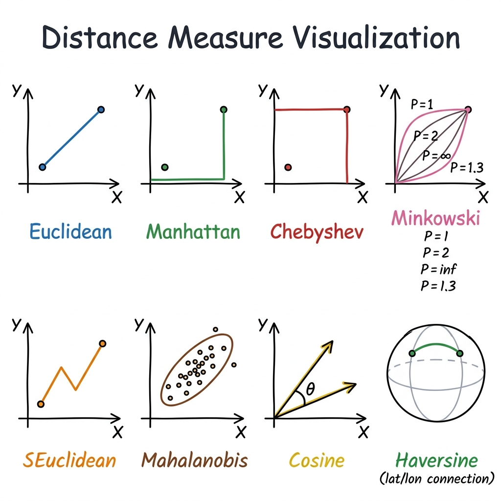

# Extra Knowledge — Distance Measures in Clustering

> **Related Topic:** Week 1 — K-Means Clustering  
> **Purpose:** Understanding how distance is measured, why K-Means is limited to Euclidean, and what alternatives exist.

---

## Distance Measure Visualization



---

## 1. Overview of Each Distance Measure

| Measure | Key Idea | Best Used For |
|---|---|---|
| **Euclidean** | Straight-line (shortest path) between two points | General numeric data, 2D coordinates |
| **Manhattan** | Move along axes only (like city blocks) | Data with many outliers |
| **Chebyshev** | Maximum difference along any single axis | Chess-like movement problems |
| **Minkowski** | Generalized formula — parent of Euclidean & Manhattan | Flexible distance tuning |
| **SEuclidean** | Euclidean with per-axis standardization | Features with very different scales |
| **Mahalanobis** | Accounts for data distribution shape (ellipse) | Correlated features, statistical outlier detection |
| **Cosine** | Measures the angle between two vectors, not magnitude | Text / NLP / Recommendation systems |
| **Haversine** | Distance on a sphere surface (great-circle) | GPS / Latitude-Longitude data |

---

## 2. Minkowski — The Parent Formula

Minkowski is the **generalization** of several distance measures using parameter **P**:

$$d = \left( \sum_{i=1}^{n} |x_i - y_i|^P \right)^{1/P}$$

| P value | Equivalent to |
|:---:|---|
| P = 1 | **Manhattan** Distance |
| P = 2 | **Euclidean** Distance |
| P = ∞ | **Chebyshev** Distance |

```python
from scipy.spatial.distance import minkowski

x = [1, 2]
y = [4, 6]

print(minkowski(x, y, p=1))  # Manhattan  → 7.0
print(minkowski(x, y, p=2))  # Euclidean  → 5.0
print(minkowski(x, y, p=10)) # → approaches Chebyshev
```

---

## 3. Why K-Means Only Uses Euclidean

> ⚠️ **`sklearn.cluster.KMeans` enforces Euclidean Distance only.** You cannot change it via a parameter.

**Why?** K-Means finds cluster centers by computing the **mean** of all points in a cluster. The mathematical proof that this minimizes WCSS only holds in **Euclidean space**.

```python
# KMeans always uses Euclidean — no metric parameter available
from sklearn.cluster import KMeans

model = KMeans(n_clusters=3, random_state=42)
model.fit(X)
```

---

## 4. K-Means vs K-Medoids

| | K-Means | K-Medoids |
|---|---|---|
| Center point | Virtual mean (may not exist in data) | Actual data point (medoid) |
| Distance | **Euclidean only** | **Any metric** (Manhattan, Cosine, etc.) |
| Outlier sensitivity | High | Lower — more robust |
| Speed | Faster | Slower |

```python
# K-Medoids supports any distance metric
# pip install scikit-learn-extra

from sklearn_extra.cluster import KMedoids

model = KMedoids(n_clusters=3, metric='manhattan', random_state=42)
model.fit(X)
print("Medoid indices:", model.medoid_indices_)
print("Labels:", model.labels_)
```

---

## 5. Alternatives When You Need a Different Distance

### Option A — Cosine (Text / NLP)
Use **Spherical K-Means**: L2-normalize the data first, then apply standard K-Means.

```python
from sklearn.preprocessing import normalize
from sklearn.cluster import KMeans

X_normalized = normalize(X, norm='l2')  # L2-normalize → cosine similarity becomes Euclidean
model = KMeans(n_clusters=3, random_state=42)
model.fit(X_normalized)
```

### Option B — Manhattan / Any Metric via K-Medoids

```python
from sklearn_extra.cluster import KMedoids

# Manhattan
km = KMedoids(n_clusters=3, metric='manhattan', random_state=42).fit(X)

# Cosine
km = KMedoids(n_clusters=3, metric='cosine', random_state=42).fit(X)
```

### Option C — sklearn Algorithms That Accept `metric` Parameter

```python
from sklearn.cluster import DBSCAN, AgglomerativeClustering

# DBSCAN with Manhattan
db = DBSCAN(eps=0.5, min_samples=5, metric='manhattan').fit(X)

# Agglomerative with Cosine
agg = AgglomerativeClustering(n_clusters=3, metric='cosine', linkage='average').fit(X)
```

---

## 6. Practical Comparison of Distance Metrics

```python
from scipy.spatial.distance import euclidean, cityblock, chebyshev, cosine
from scipy.spatial.distance import mahalanobis, seuclidean
import numpy as np

x = np.array([1.0, 2.0])
y = np.array([4.0, 6.0])

print(f"Euclidean  : {euclidean(x, y):.4f}")   # 5.0000
print(f"Manhattan  : {cityblock(x, y):.4f}")   # 7.0000
print(f"Chebyshev  : {chebyshev(x, y):.4f}")   # 4.0000
print(f"Cosine     : {cosine(x, y):.4f}")       # angle-based
```

---

## 7. Quick Decision Guide

```
What type of data do you have?
│
├── Numeric (2D/3D coordinates, age, score...)
│   ├── No outliers → Euclidean
│   └── Has outliers → Manhattan or K-Medoids
│
├── Features with very different scales (e.g. age vs. salary)
│   └── SEuclidean or StandardScaler + Euclidean
│
├── Correlated features or statistical outlier detection
│   └── Mahalanobis
│
├── Text / Bag-of-Words / TF-IDF / Embeddings
│   └── Cosine (L2-normalize → K-Means, or K-Medoids with cosine)
│
└── GPS Coordinates (Latitude / Longitude)
    └── Haversine
```

---

## 8. Haversine — Distance on Earth's Surface

```python
from sklearn.metrics.pairwise import haversine_distances
import numpy as np

# Coordinates in radians [lat, lon]
bangkok = np.radians([[13.7563, 100.5018]])
london  = np.radians([[51.5074, -0.1278]])

dist_rad = haversine_distances(bangkok, london)
dist_km  = dist_rad * 6371  # Earth radius in km

print(f"Bangkok → London: {dist_km[0][0]:.1f} km")
```

---

*Applied Machine Learning — DSBA8 | Week 1 Extra Knowledge*

---

## 9. Common Misconception — How K-Means Centroid Actually Works

> ❓ **"Does K-Means find the nearest data point to the average and use that as the centroid?"**  
> ❌ **No** — this is a common point of confusion. Here is the correct explanation:

### K-Means — Centroid = Direct Average (Mean)

The centroid in K-Means **is the mean of all points in the cluster, calculated directly**.  
It does **not** search for the nearest existing data point to use as the center.

```
Cluster has 3 points: (1,2), (3,4), (5,6)
Centroid = mean = ((1+3+5)/3, (2+4+6)/3) = (3.0, 4.0)
```

> ⚠️ The centroid **may not be an actual data point** in the dataset — it is a computed virtual point.

```python
import numpy as np
from sklearn.cluster import KMeans

X = np.array([[1, 2], [3, 4], [5, 6], [7, 8]])
model = KMeans(n_clusters=2, random_state=42).fit(X)

print("Centroids:", model.cluster_centers_)
# These are pure averages — not necessarily any point from X
```

---

### Correct K-Means Flow

```
1. Randomly initialize K centroids
         ↓
2. Assign each data point to the nearest centroid (using Euclidean distance)
         ↓
3. Recompute each centroid = mean of all points assigned to it  ← this!
         ↓
4. Repeat steps 2–3 until centroids no longer move
```

---

### What You Described = K-Medoids

The idea of *"picking the actual data point closest to the center"* is exactly how **K-Medoids** works:

| Feature | K-Means | K-Medoids |
|---|---|---|
| **Center is** | Mean of cluster (virtual point) | Actual data point (medoid) |
| **Must exist in dataset** | ❌ No | ✅ Always |
| **Outlier resistance** | Lower | Higher |
| **Distance metric** | Euclidean only | Any metric |

```python
# pip install scikit-learn-extra
from sklearn_extra.cluster import KMedoids

model = KMedoids(n_clusters=2, metric='euclidean', random_state=42).fit(X)

print("Medoid indices:", model.medoid_indices_)   # index of actual data points
print("Medoids:", X[model.medoid_indices_])        # real points from dataset
```

---

*Applied Machine Learning — DSBA8 | Week 1 Extra Knowledge*
